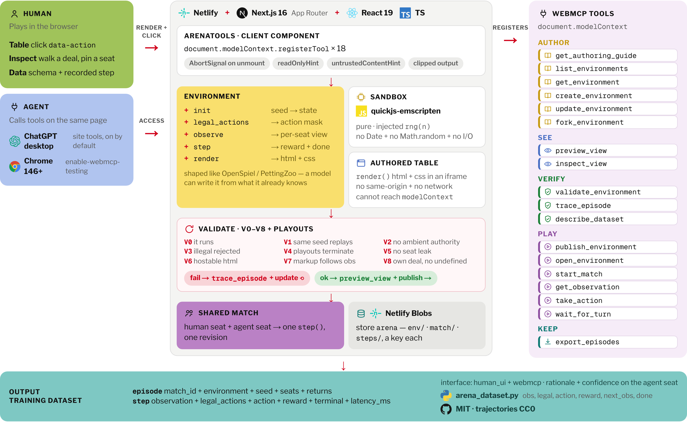

# Arena

Author a game environment as five JavaScript functions, verify it, play it against a person or an
agent, and keep the match as reinforcement-learning trajectories.

The human uses the board. An agent on the same page uses tools registered on
`document.modelContext`. Both write into one dataset.



## Run

```bash
npm install
npm run dev
```

Open http://localhost:3000 and ask an agent to design a game. It writes the rules and the table
both. The guide hands over the contract and the sandbox rules and nothing else — no palette, no
worked example, no catalogue to copy from. The contract is the ordinary one, close enough to
OpenSpiel or PettingZoo that a model can write against it from what it already knows, so what
lands on the page is authored rather than assembled. Nothing ships with it: the page starts
empty, and every game on it was written there.

## Layout

```
.
├── README.md
├── package.json
├── netlify.toml              deploy config + the Next runtime plugin
├── next.config.ts
├── arena_dataset.py          read exported episodes from Python
│
├── docs/
│   ├── architecture.png      the figure above, drawn from /diagram
│   └── webmcp.md             the API, the security model, browser support
│
├── src/app/
│   ├── layout.tsx            mounts the tool surface on every page
│   ├── page.tsx              the gallery
│   ├── e/[id]/
│   │   ├── page.tsx          Table — take a seat and play
│   │   ├── inspect/          walk a deal, pin a seat
│   │   └── data/             schema, sample row, who sees what
│   ├── diagram/              problem/, solution/ — the appendix pages
│   └── api/
│       ├── environments/     create, fork, update, validate, publish,
│       │                     view, trace, dataset
│       ├── matches/          start, observe, act, wait, bot
│       ├── episodes/         the tape as NDJSON
│       ├── guide/            the authoring contract
│       └── trace/            flight recorder for tool calls
│
├── src/components/
│   ├── ArenaTools.tsx        registers 18 document.modelContext tools
│   ├── PlayDesk.tsx          the table a person plays at
│   ├── InspectDesk.tsx       step through a deal without playing it
│   ├── DataPanel.tsx         what a recorded step actually holds
│   └── GameView.tsx          authored html + css in a sandboxed iframe
│
├── src/lib/
│   ├── sandbox.ts            quickjs-emscripten — pure, injected rng
│   ├── validate.ts           V0–V8 and the playout sweep
│   ├── store.ts              Netlify Blobs, one key per game, match, tape
│   ├── match-service.ts      one step(), one revision, one tape
│   ├── session.ts            the seat a person holds and an agent joins
│   ├── view-*.ts             render, project and host the authored table
│   └── guide.ts              what an author is told, and nothing beyond it
│
└── scripts/
    ├── smoke-*.mjs           what npm run check:* runs
    ├── agent-live.mjs        drive a model against the live tool surface
    ├── audit-episodes.mjs    check a recorded tape against its schema
    ├── diagram-png.mjs       redraw docs/architecture.png
    └── purge.mjs             remove a game from the deployed store
```

## The environment contract

```js
init(seed)                   -> state
legal_actions(state, player) -> string[]
observe(state, player)       -> observation
step(state, action)          -> { state, rewards, terminal }
render(observation)          -> { html, css }
```

Functions are pure. `Date`, `Math.random`, and I/O are unavailable. Use the injected `rng(n)` if
the game needs chance, and keep a `rng_cursor` on state.

`render` returns HTML and CSS. Clickable nodes use `data-action` matching a legal action id. The
page hosts that markup in an iframe with no same-origin access and no network reach, so authored
markup cannot touch the page, its storage, or the tool surface.

Because anyone can author an environment, everything downstream of one is treated as hostile input.
Every tool that hands back a name, an observation, a validation message, or a board carries
`untrustedContentHint`, and text lifted off the table is stripped of line breaks and capped before it
reaches a report an agent reads as prose.

## Looking at the table

An agent cannot tell whether a board is right by reading its own HTML, so `preview_view` and
`inspect_view` describe what actually painted: repeated same-size boxes collapse into a character
grid with their real colours, everything else becomes positioned text, and every control is listed
with its size and whether it is enabled.

```
grid 7 cols x 6 rows, cell 40x40px:
  . . . . . . .
  . . . . . . .
  . . . . . . .
  . . . . . . .
  . . . A . . .
  . . B A B . .
  legend: .=#14392c x38  A=#f3d37a x2  B=#fffaf0 x2
around it:
  [Column 1 -> col_0]  [Column 2 -> col_1]  …
```

`preview_view({ environment_id, moves: [...] })` renders a position part-way through a game, which
is the only way to see whether the markup follows the state. Problems that stop the table working
are reported separately from cosmetic notes.

A person gets the same thing on the **Inspect** tab of any game, published or not. It walks the
game without starting a match: click the board to play a line forward, step back, deal a different
seed, and read the observation each seat was handed beside the board it produced, with the five
functions underneath. Pinning a seat shows what that side can see while the other one moves — in a
game with hidden cards the two views should not match, which is the V5 guarantee made visible
rather than asserted.

## Checks

Publishing runs V0–V8: the code runs, the same seed replays, the sandbox has no ambient authority,
illegal actions are rejected, random playouts terminate, `observe` does not leak another seat's
private fields, `render` returns hostable HTML, changing an observation field changes the markup,
and every seat can see its own deal without `undefined` in it.

## Tools

All eighteen are registered from one client component,
[`src/components/ArenaTools.tsx`](https://github.com/amelia751/arena-mcp/blob/main/src/components/ArenaTools.tsx),
which [`src/app/layout.tsx`](https://github.com/amelia751/arena-mcp/blob/main/src/app/layout.tsx#L34)
mounts on every page so the surface is there wherever the person is. The
[tool table](https://github.com/amelia751/arena-mcp/blob/main/src/components/ArenaTools.tsx#L418)
holds one entry per tool and the
[registration loop](https://github.com/amelia751/arena-mcp/blob/main/src/components/ArenaTools.tsx#L1065-L1077)
hands each to the browser:

```ts
const model = document.modelContext ?? navigator.modelContext;

model.registerTool(
  {
    name: "create_environment",
    title: "Create a new game",
    description:
      "Create an environment. code may be partial — send the functions you have and build up. " +
      "Validation runs immediately and comes back with the result.",
    inputSchema: { /* ... */ },
    annotations: { /* ... */ },
    execute: async (input, run) => { /* ... */ },
  },
  { signal },
);
```

The second argument carries an `AbortSignal`, which is the only way to withdraw a tool — there is
no `unregisterTool()`. `src/lib/webmcp.d.ts` types the API, and `src/AGENTS.md` covers checking a
tool is really exposed in Chrome rather than merely rendered.

| Tool | What it does |
| --- | --- |
| `get_authoring_guide` | Contract, sandbox rules, HTML/CSS render rules, the preview loop |
| `preview_view` | Draw markup, or a saved `render()` at any position, and describe what painted |
| `inspect_view` | Describe the live table the person is playing on |
| `list_environments` | What exists on the page, with validation state |
| `get_environment` | Spec and source, optionally one function |
| `create_environment` | New draft; validation runs immediately |
| `fork_environment` | Copy a validated environment |
| `update_environment` | Patch one function |
| `validate_environment` | V0–V8 plus playouts, as repair text |
| `trace_episode` | Step through a deal and watch state, legal actions, observation, rewards |
| `describe_dataset` | Trajectory schema and a sample row |
| `publish_environment` | Shareable `/e/{id}` if checks pass |
| `open_environment` | Put an environment's table on the person's screen |
| `start_match` | Deal a match on that table and take the opposite seat |
| `get_observation` | That seat's view and legal actions |
| `take_action` | Play a legal action |
| `wait_for_turn` | Rejoin a match by holding the call open until the person has moved |
| `export_episodes` | What was recorded, plus a download link |

The person and the agent share one page, so a tool that writes reloads the gallery from the live
list and repaints the table before it answers. A draft the agent creates is on screen by the time
it says so, and nothing here needs a reload to be seen.

## Dataset

Each match is an `episode` header plus `step` rows:

```
observation, legal_actions, action, reward, terminal, latency_ms
```

Download from the play panel or `GET /api/episodes?match_id=…&format=jsonl`. A Python loader lives
in `arena_dataset.py`.

The **Data** tab of any game is the human side of `describe_dataset`: the schema a match writes,
a real recorded step, which observation fields the table actually paints, and which fields differ
by seat. The checks sit on top of it as a pass strip, since what a game records is only worth
reading once you know it holds up.

## Checking it yourself

`document.modelContext` needs Chrome 146+ with `chrome://flags/#enable-webmcp-testing` enabled, or
Chromium launched with `--enable-features=WebMCPTesting`. It is gated to secure contexts, so use
`http://localhost` rather than a file or a raw IP.

```bash
npm run build && npm start          # the tools are registered on the running page

npm run check:view                  # what preview_view and inspect_view answer
npm run check:play                  # a human click and an agent move in one match
npm run check:sandbox               # markup that escapes the sanitizer stays contained
npm run check:refresh               # what a tool writes is on screen without a reload

npm run agent -- --task connect4    # a model authors a game and plays it, through the real tools
```

`npm run agent` drives a Vertex model against the tools discovered by
`document.modelContext.getTools()` in a real browser, plays the human side by clicking the live
board, and writes a transcript and screenshots to `.data/live/`. It needs `gcloud` credentials for
the project named in `scripts/agent-live.mjs`.

## License

MIT. Recorded trajectories are intended to be used as training data (CC0).
